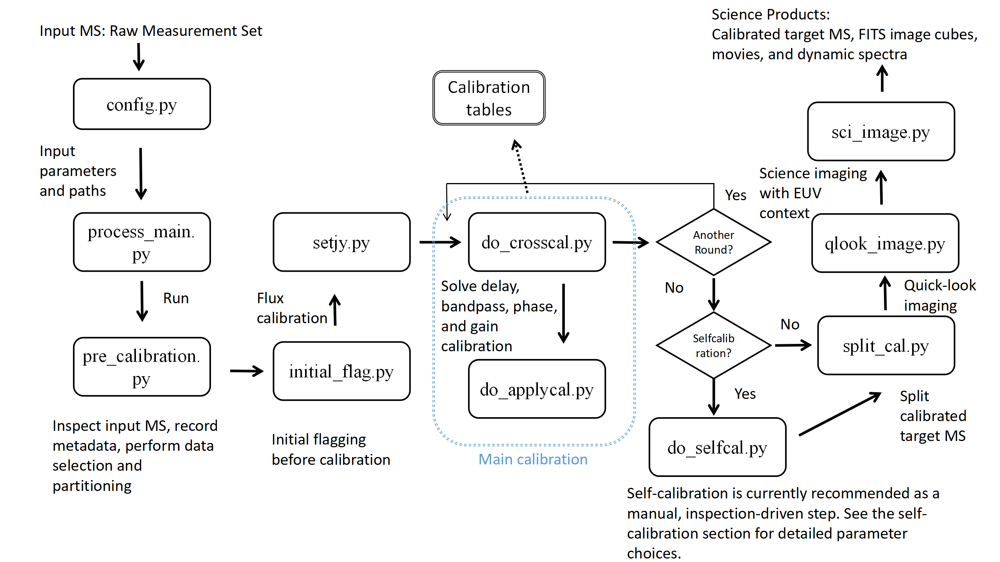

# Solar-Radio-Interferometric-Imaging
This is the repo for solar radio Interferometric Imaging

## Workflow Overview

This repository is organized around a modular workflow for MeerKAT solar imaging spectroscopy. The processing starts from an input MeerKAT Measurement Set and a user-defined configuration file. The main workflow performs data inspection, data selection and partitioning, initial flagging, cross-calibration, optional solar self-calibration, and science imaging. The final products include calibrated target Measurement Sets, FITS image cubes, radio/EUV context movies, and dynamic spectra.

**Figure 1.** Workflow of the MeerKAT solar imaging spectroscopy pipeline. The pipeline starts from an input MeerKAT Measurement Set and a user-defined configuration file, followed by data inspection, partitioning, initial flagging, cross-calibration, optional solar self-calibration, and science imaging. The main science products include calibrated target Measurement Sets, FITS image cubes, radio/EUV context movies, and dynamic spectra.
